# Assignment 3 Answers

---

Name: Abdulla Alameri

ID: 1070401

Class: Operating Systems

---

## Question 1
> Create some space on your hard drive to work on this assignment (highly recommended to use VirtualBox or other virtual machine software to assign some space for the Guest OS to create partition and file system). This would mimic a new hard drive attached to your Guest OS. You can also use a separate USB drive for this assignment but it is not recommended. 


Answer: Through the GUI of virtual box we can add a virtual harddrive where we can do the assignment with  

**VM settings> storage > add virtual drive> follow gui instructions and make it a secondary drive**


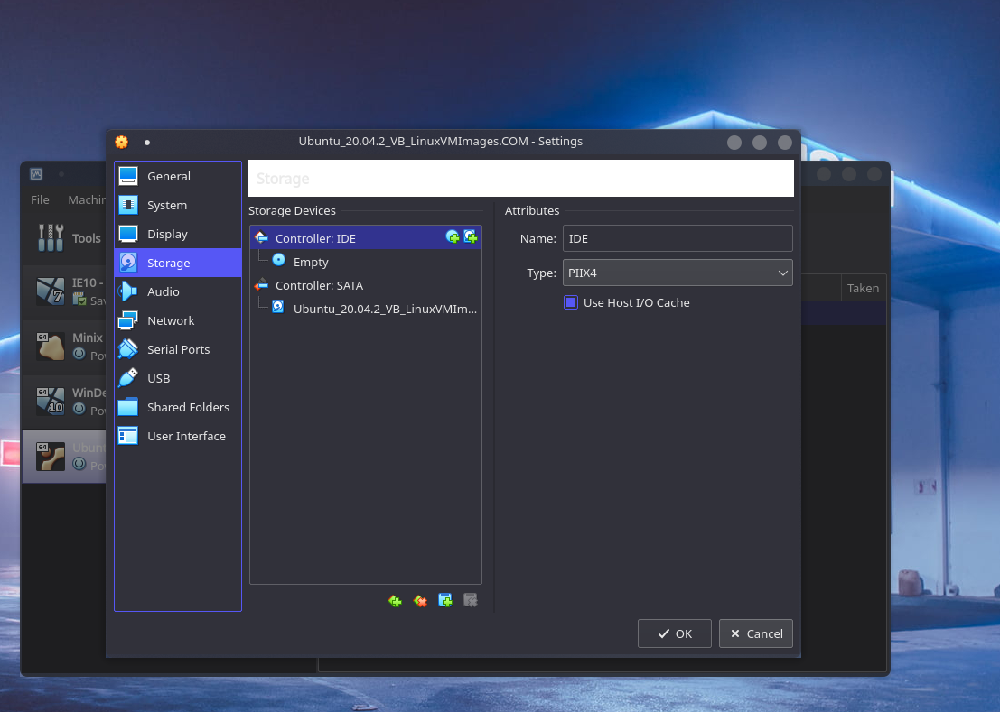
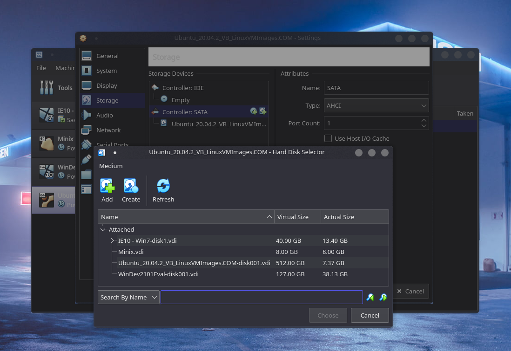
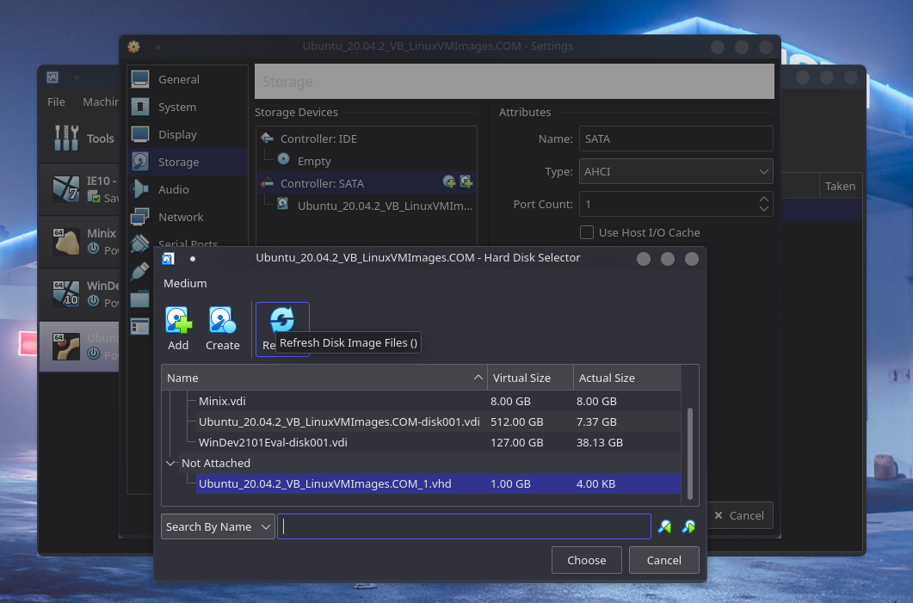
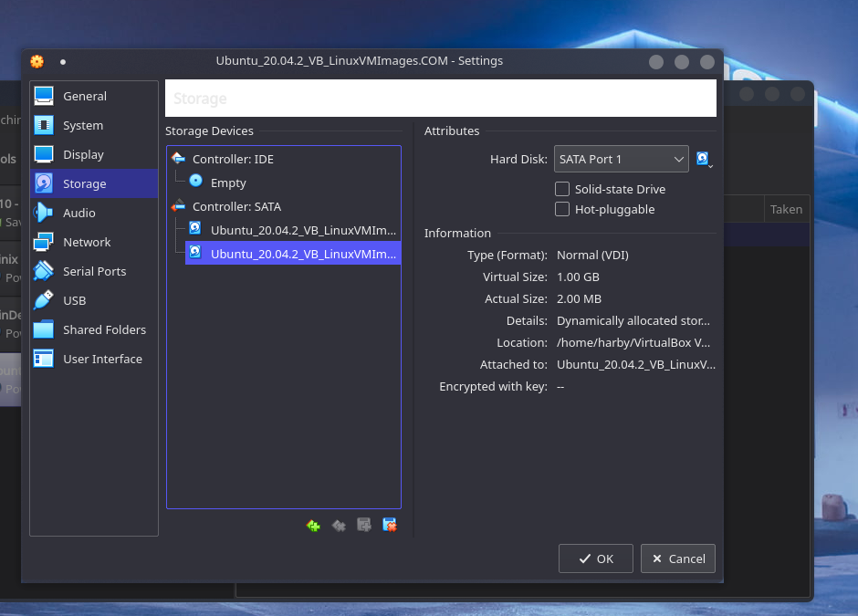

## Question 2
> Verify the new disk (new space) in the Guest OS (Linux through GUI and Terminal)

Answer: we can use the following command to find harddrive, since we have given it a virtual size of 1 GB, it should list the size as such

```bash
sudo fdisk -l
```
Or **Menu> search 'disks'> open disks program**

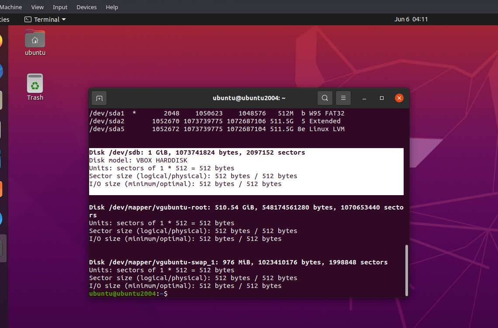
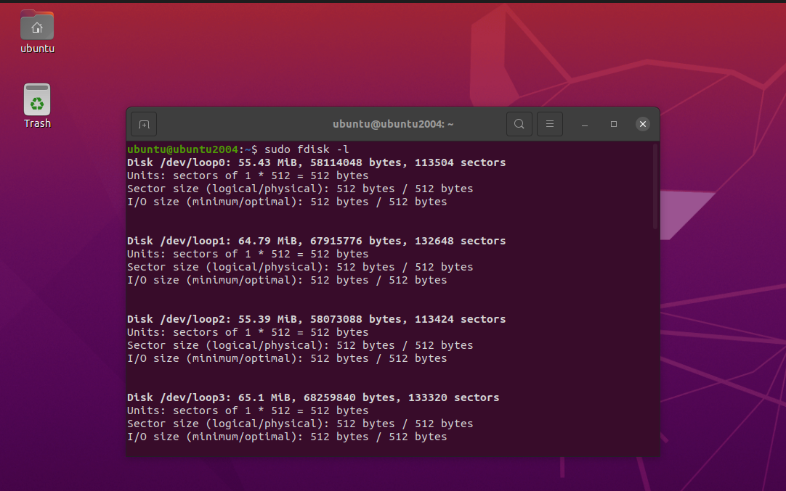
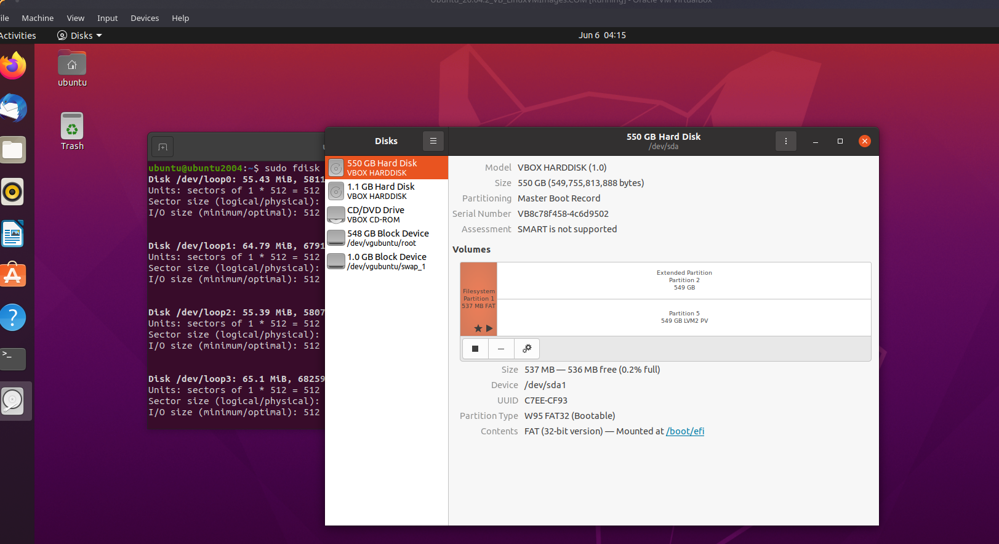

## Question 3

> Get the name of the new disk before partitioning it (you can use any built-in utilities in Linux for getting the name)


```bash
sudo fdisk -l
```
Answer: with the above command we can get both the name of the new disk, and its size before the partioning
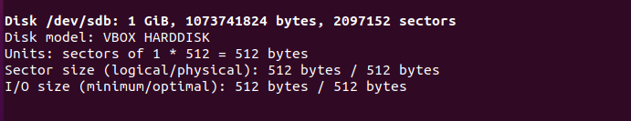

## Question 4
>     4. Partition the new disk with the following settings 
>     (you can use any utility in Linux you like for partitioning 
>     but it should be command line interface based and should NOT be GUI based): 
> -   Type: Primary 


> -   Number: 1 


> -   First Sector: Default 


> -   Last Sector / Size: 300M 


Answer: to do this, we can also used fdisk command  and passing the diractory of the virtual drive as follows as follows 

```bash
sudo fdisk /dev/sdb
```
This will lead us to be greeted with a CLI that asks for arguments to the paramters stated in the question

NOTE: to end the partion, need to enter 'w', see the menu with 'm' for more details.

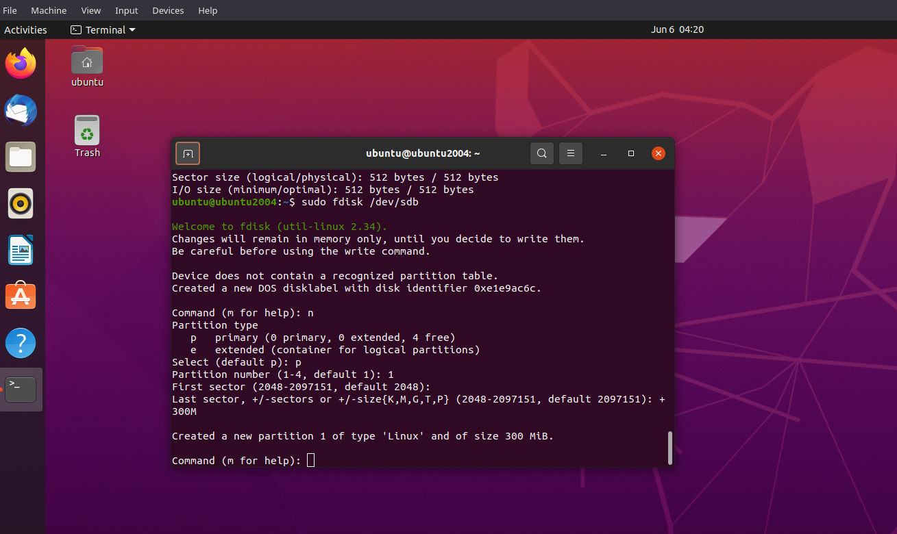
## Question 5 
> Print the partition table to view the partition and ensure that type is Linux

Answer: thre is two ways to do this, one would be from the fdisk command by entering 'p'
or with the following command
```bash 
sudo fdisk -l
``` 


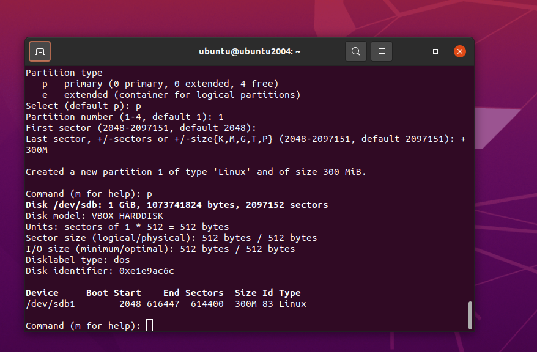

## Question 6

> Make an ext3 filesystem for this newly created partition that allows Journaling system

we can make a filesystem with the mkfs command, like so 


```bash
sudo mkfs -t ext3 /dev/sdb1
```


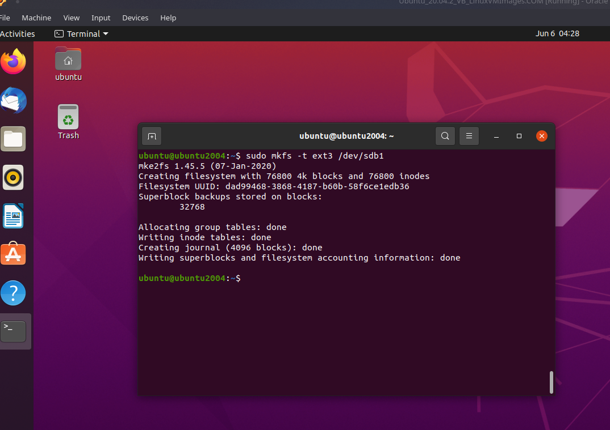

## Question 7

> Mount this filesystem at ~/newvolume (where newvolume is a directory)

Answer: from home or '~'
```bash
mkdir newvolume && sudo mount /dev/sdb1 ~/newvolume 

```

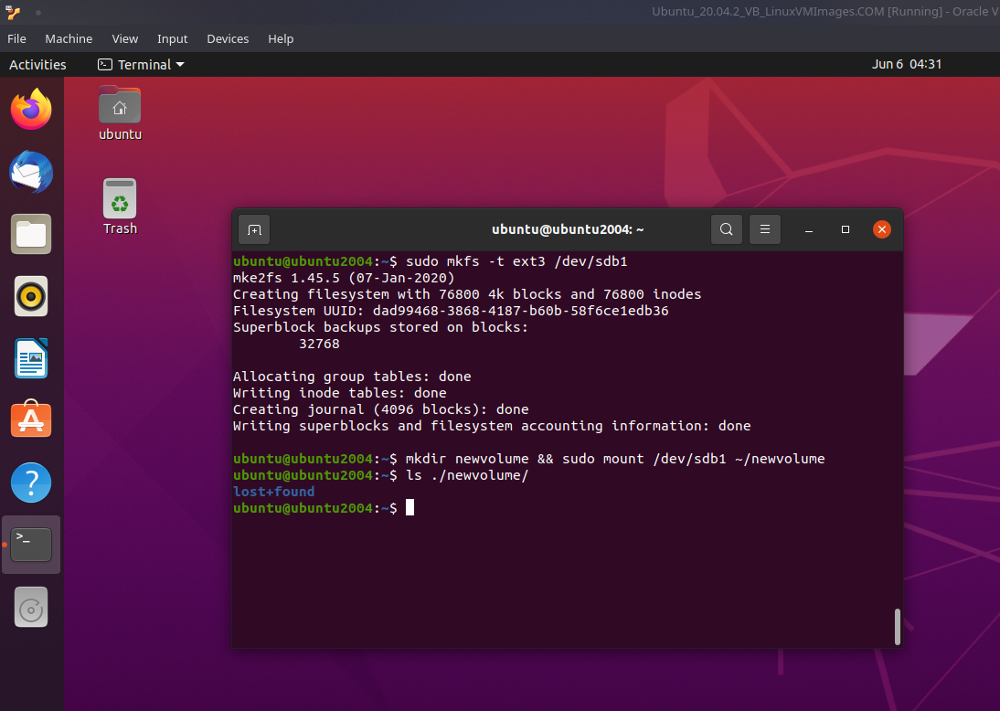

## Question 8 

> Navigate to this directory to verify the filesystem is mounted, e.g., should contain lost+found 

Answer: 
```bash
ls ~/newvolume

```


## Question 9 

> Finally, create a directory named, “Operating System” on this volume and place any file inside this directory. 

Answer: first be root, then make the diractory and new file

```bash
sudo su - 
cd /home/ubuntu 
mkdir ./newvolume/Operating\ System && echo 'new file!'>> ./newvolume/Operating\ System/newfile.txt
cat ./newvolume/Operating\ System/newfile.txt

```
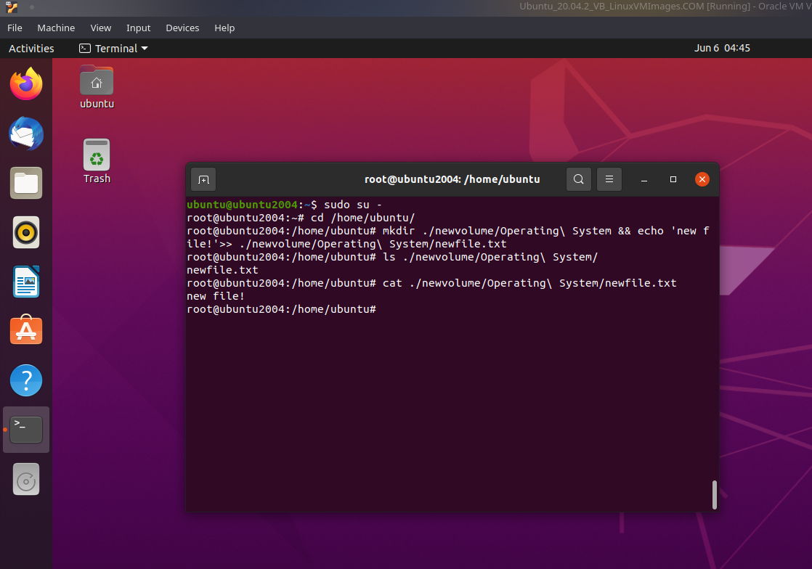

## Question 10

> This newly created directory named, “Operating System” should be read-only for all the users on the system except “root” that has read, write and executable permissions on this directory.

Answer: using the chmod command we can change the permissions , we'll use it as follows while we are still in root

```bash
chmod 744 ~/newvolume/Operating\ System

```

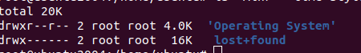
